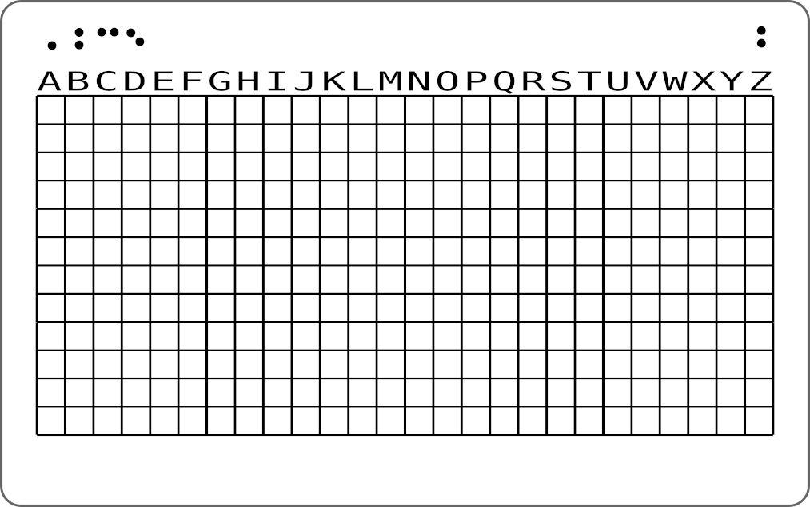

### Simple Metal Seed (BIP39)

This is an idea for making metal seeds using a Braille-like dot pattern to reduce size and provide a small amount of obfuscation.

A grid with alphabetic columns is used to the mark letters of each word. Other systems use one dot per letter and require 4 rows per word, or 96 rows per 24 word seed. The overall size can be reduced greatly by marking multiple letters per row using a dot pattern for order. It's important to keep it simple enough to decode later with only basic logic and no other materials. To this end I came up with a letter ordering dot pattern using between 1 and 4 dots (mostly 1 or 2 dots, very rarely a 4 dot grouping).

The SVG files provided are print templates. A pencil or pen can be used to mark dots in the grid and then once taped to metal, whether small credit card size plate or steel bridge girders in plain site, can be marked with a cheap spring loaded center punch. Below is an example on aluminum. For long term fireproof storage my preference is low-cost Titanium plate. I bought low-cost Grade 2 1mm thick 10x10cm plate on ebay for a mere $3. A spring loaded center punch only costs $2-3 (if one is not already in your tool kit). Together they make an fast, easy method for marking most metals.

### SVG Layout Examples

I have included svg files for credit card size (convenient to carry or store) and snapshot photo size (can be hidden in photo frame as backing). It is also quite feasible to laminate a metal plate with paperboard or printed reference material to make it less visible. Variations of these examples are endless to suit personal needs. Use them only as starting points. I added a legend line as reminder of dot order and a side marker (1 or 2), top right. These svg files load and print fine in Inkscape but the preview usually seems to misalign the text.

### Dot Patterns

The basic pattern is shown as legend in the svg file as reminder when decoding. Only four letters are required for BIP39 word uniqueness. The first letter of each word is marked with a single dot. The second with two vertical dots, third with two horizontal dots, and last with two diagonal dots. 

Some words have two of the same letters - in that case a simple overlay combination of dots works. It is never ambiguous because the remaining letters indicate other positions. There is a few cases where a word has three same letters. I used a four dot marking for that.

### Reading Back (someday after the big fire)

Write the alphabet on a paper edge (match spacing). Line up the paper edge as a ruler along the rows and write down letters according to dot pattern for ordering. Simple.

### Further Obfuscation

I've included a couple credit card size "Knot Reference" images for printing. These can be stuck over a metal plate to hide it's underlying purpose. Of course, any other suitable printed content could be used. Waterproof laser paper probably works best, or sticker sheets.

Another simple extension is to scramble the alphabet ruler ordering. I experimented with simple letter shifts using a password. For example, if the password is BOGART then after writing the alphabet change B to O, O to G, G to A, and so on wrapping around. This is not technically very secure and so only provides obfuscation of the words, not encryption. It may be enough to delay or put off casual attackers finding the metal makes no immediate sense but any determined cracker can analyze the BIP39 word list and match up candidate words, reversing the letter shifts.

It adds another thing that must be remembered and so I personally haven't used it. **KISS**.
